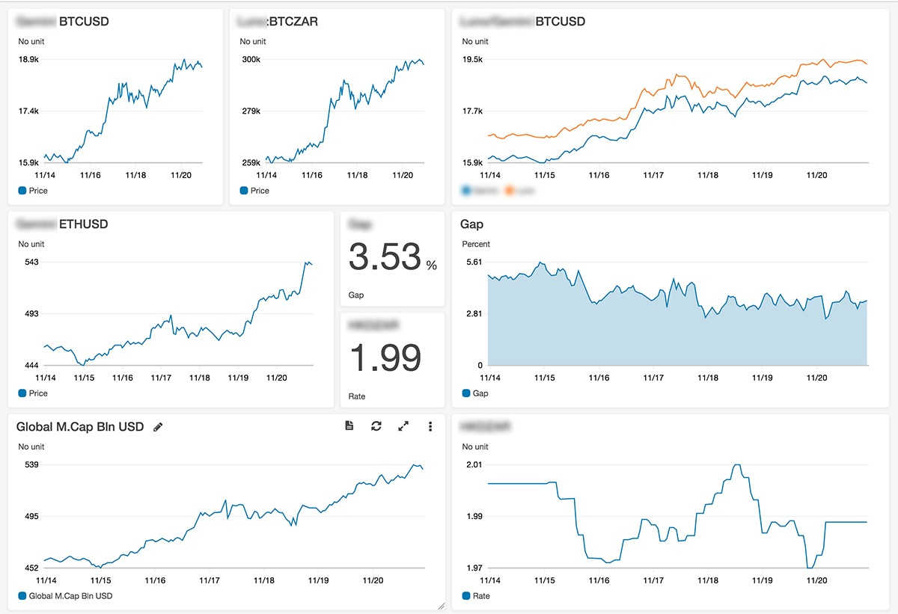

# CryptoDashboard
A little widget of crypto-related price feeds at my fingertips

  - `/api/prices` - a page which you can pin to your home screen with an app like [glimpse](https://community.smartthings.com/t/ios-widget-dashboard-glimpse-and-smarttiles/42186)
  - `/api/status` - a JSON feed of various curated crypto price info, which serve as a starting point for Google Sheet portfolio tracking


The data gets pushed to AWS CloudWatch for visualisation and safekeeping



# API Usage
This program makes use of the following APIs:

  - [Cryptowatch](https://cryptowat.ch/) for cryptocurrency prices at major exchanges
  - [CoinMarketCap](https://cryptowat.ch/) for crypto total market cap
  - [Open Exchange Rates](https://openexchangerates.org/) for FX data
  - [CloudWatch](https://aws.amazon.com/cloudwatch/) API for pushing datapoints to AWS

# Dependencies
```sh
dotnet add package Newtonsoft.Json --version 10.0.3
dotnet add package AWSSDK.Core --version 3.3.21.11
dotnet add package AWSSDK.CloudWatch --version 3.3.5.1
```

# Build
```sh
dotnet publish -c Release -r linux-x64 -o /api
```

# Run
```sh
dotnet api.dll
```
